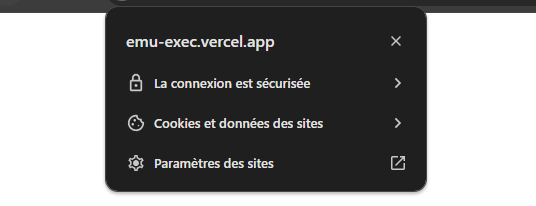
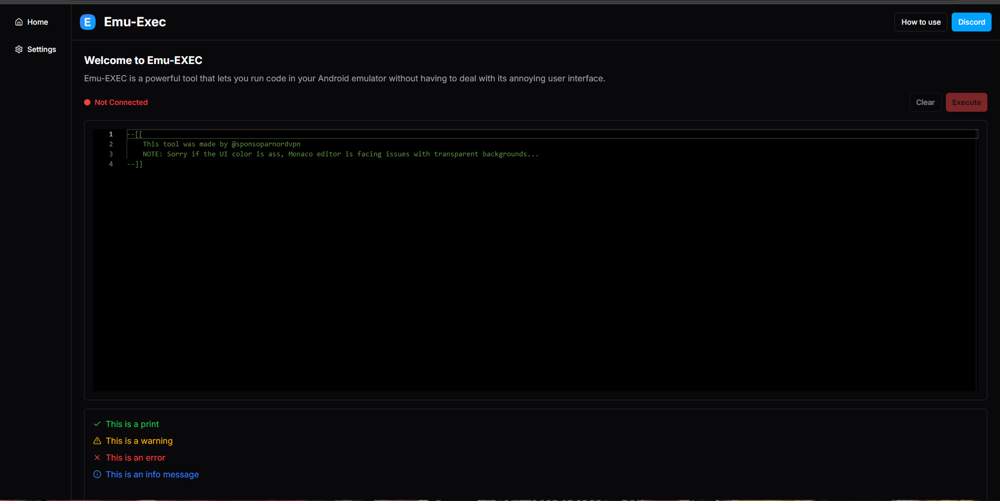

# Emu-Exec

**Emu-Exec**: A Free and Powerful Injection Tool for Your Emulation Needs

---

## Tutorial

To get started with Emu-Exec, follow these steps:

1. **Download**: Obtain the Emu-Exec tool [here](https://emu-exec.vercel.app/). For additional security, you can check the file with [VirusTotal](https://www.virustotal.com/gui/file/3e2eabdf38aa04a546b0f07875d3854561f5f6f07dd3c0adaaca8a5672b96934).

2. **Windows Defender Exception**: Please note that Windows Defender may flag Emu-Exec as a Trojan because it creates a server on your IP address. You will need to create an exception for it in Windows Defender.

3. **Setup**: After downloading, decompress the ZIP file and run the Emu-Exec application. Wait for the app to initialize, then copy your network IP address and the server link.

   

   Make sure not to close the command prompt window during this process.

4. **Browser Configuration**: Open your preferred browser (this tutorial uses Chrome) and paste the server link into the console. If you encounter a client-side exception error due to insecure WebSocket connections (ws instead of wss), follow these steps:

   - Click the button that appears in the error message.
   
     
   
   - Select "Website Settings".
   
     
   
   - Scroll down and find the option for "Insecure content".
   
     
   
   - Click the dropdown menu and select "Authorize". After that, return to the page and refresh it. You should see something like this:

     

5. **Execute Code**: Go to the emulator of your choice, get an executor, and inject the following Lua code:
    Make sure to replace the IP string with the IP showed in the command prompt
   ```lua
   print("Emu-Exec 1.0.0")
   local IP = "REPLACE_WITH_THE_IP_IN_THE_CMD"
   local ws = WebSocket.connect("ws://"..IP..":7890/Execute")
   local oldprint = clonefunction(print)
   ws.OnMessage:Connect(function(code)
      local success, error = pcall(runcode, code)
      if not success then
         warn("Error while executing code:", error)
      end
   end)
   ```

You can now use emu-exec!!
